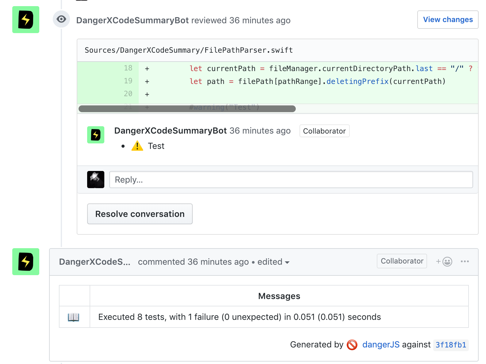

# DangerXCodeSummary
A Danger-Swift plugin that adds build errors, warnings and unit tests results generated from xcodebuild to your Danger report

Inspired by [danger-xcode_summary](https://github.com/diogot/danger-xcode_summary)



## Getting Started

- Install [xcpretty](https://github.com/supermarin/xcpretty) and 
[xcpretty-json-formatter](https://github.com/marcelofabri/xcpretty-json-formatter) 

- Add this to your `Dangerfile.swift`

```swift
import DangerXCodeSummary // package: https://github.com/f-meloni/danger-swift-xcodesummary

let summary = XCodeSummary(filePath: "result.json")
```

- Generate the report file on CI before run Danger-swift
```bash
#!/bin/bash

xcodebuild | XCPRETTY_JSON_FILE_OUTPUT=result.json xcpretty -f `xcpretty-json-formatter`
```

- (Recommended) Cache `~/.danger-swift` folder


## Run with SPM
DangerXCodeSummary can be used with SPM (this repo uses it on the Linux CI), but at the moment, if you use SPM, falining tests inline messages are not generated.
To generate the report run:

```bash
swift test | XCPRETTY_JSON_FILE_OUTPUT=result.json xcpretty -f `xcpretty-json-formatter`
```

## Send report to Danger

```swift
summary.report()
```

## Warning and Errors count

```swift
if summary.errorsCount > maxErrorCount {
  fail("There are more than \(maxErrorCount) errors"
}

if summary.warningsCount > maxWarningsCount {
  fail("There are more than \(maxWarningsCount) warnings"
}
```
